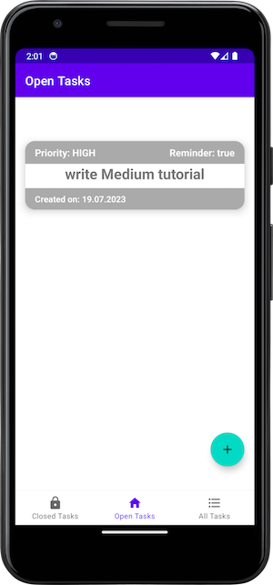
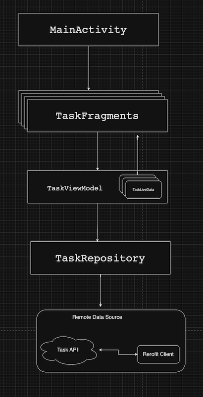
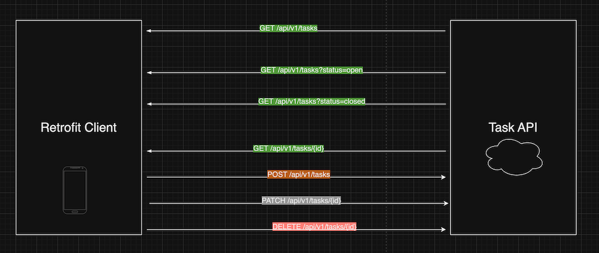

# Android App for Task API
Here is the link for the YouTube series:

## How the finished app will look like:

## How the app MVVM architecture will look:

## This diagram shows all the HTTP CRUD operations:
